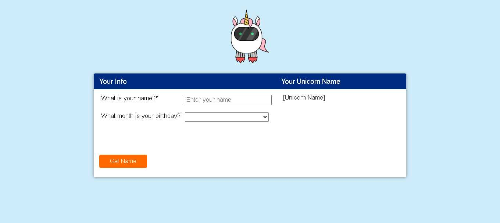

# RPA Uipath Tutorial

More images of the project can be found in the ".screenshots" folder.

---

### Table of Contents

- [Description](#description)
- [How To Use](#how-to-use)
- [References](#references)
- [License](#license)
- [Author Info](#author-info)

---

## Description

This is a tutorial project using UiPath, designed to demonstrate how to extract and insert information from web pages. The process prompts the user to enter their name, then accesses a website that generates a "unicorn name" based on the provided name and birth month. The generated name is then extracted and saved in a `.txt` file.

#### Technologies

- UiPath Studio Community (2025.0.161)
- Google Chrome

[Back To The Top](#project-name)

---

## How To Use

1. Download and extract the project.
2. Open the `Main.xaml` file in UiPath Studio.
3. Enter your name in the dialog box and confirm.
4. After execution, a file named `name.txt` will be created. Open it to view the result.

#### Installation
1. Install and configure UiPath Studio Community.
2. Run the `Main.xaml` file.

#### API Reference

Website: [Unicorn Name Generator](https://www.rpasamples.com/unicornname)

[Back To The Top](#project-name)

---

## References
[Back To The Top](#project-name)

---

## License

MIT License

Copyright (c) 2024 Otávio Lira Neves

Permission is hereby granted, free of charge, to any person obtaining a copy
of this software and associated documentation files (the "Software"), to deal
in the Software without restriction, including without limitation the rights
to use, copy, modify, merge, publish, distribute, sublicense, and/or sell
copies of the Software, and to permit persons to whom the Software is
furnished to do so, subject to the following conditions:

The above copyright notice and this permission notice shall be included in all
copies or substantial portions of the Software.

THE SOFTWARE IS PROVIDED "AS IS", WITHOUT WARRANTY OF ANY KIND, EXPRESS OR
IMPLIED, INCLUDING BUT NOT LIMITED TO THE WARRANTIES OF MERCHANTABILITY,
FITNESS FOR A PARTICULAR PURPOSE AND NONINFRINGEMENT. IN NO EVENT SHALL THE
AUTHORS OR COPYRIGHT HOLDERS BE LIABLE FOR ANY CLAIM, DAMAGES OR OTHER
LIABILITY, WHETHER IN AN ACTION OF CONTRACT, TORT OR OTHERWISE, ARISING FROM,
OUT OF OR IN CONNECTION WITH THE SOFTWARE OR THE USE OR OTHER DEALINGS IN THE
SOFTWARE.

[Back To The Top](#project-name)

---

## Author Info

- LinkedIn - [Otávio Lira Neves](https://www.linkedin.com/in/otavioliraneves/)
- Gmail - [otavioliraneves@gmail.com](mailto:otavioliraneves@gmail.com)

[Back To The Top](#project-name)

